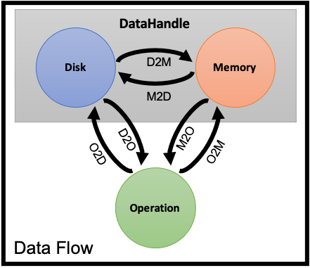

# DataHandle
A **DataHandle** is the specification of the data in the workflow file.
`DataHandler` is the coresponding module in CAP source code. 

## Introduction

Data could be anything, a single integer number or a giant table.
Example of data includes a VCF file, a phenotype file and a Python list stored in the momory.
Data can be permanent (like files) or temporary (like a python object in memory).
Permanent data is stored in different storage such as local disk, tape storage, NAS and HDFS as well as cloud storage such as S3 and Dropbox.
For simplicity we use the term **Disk** to refer to all those storages.
Permanent data could be in form of file(s), databases or something else (just in case).
Examples are
- A JSON file (single file)
- 1000 Genomes Project VCF divided by choromosems (multiple files yet we would like to have it as one peice of data)
- A MySQL table contains computed PCA scores for samples (database storage)

Some analysis requiers data to be loaded into the memory prior to the execution.
**A DataHandle provides two interface to work with data: disk interface and memory interface.**.
For simplicity we use disk and memory to refer to disk interface and memory interface respectivly.
The format data is stored in disk and the format it is stored in the memory are not the same.
Also the data can be compressed or uncompressed in both disk and memory.
There isn't a one-to-one binding between these formats.
Each disk format can be loaded into multiple memory format and each memory format can be dumped into multiple disks format
For example, tabular data can be stored using the following formats:
- Disk:
    - csv (comma-seprated values)
    - tsv (tab-seprated values)
    - parquet
    - ht (Hail)
    - MySQL table
    - DynamoDB Table (AWS cloud)
- Memory (Python, PySpark):
    - Pandas Dataframe
    - Numpy 2D array
    - Python list of dicts
    - JSON string
    - Spark Dataframe
    - Spark RDD
    - Hail Table

The figure below explain how the data flows between disk, memory and 


Notes:
- The disk `isProduced` flag is set to `true` when data is written to disk (M2D or O2D).
- The memory `isProduced` flag is set to `true` when data is loaded from disk to memory (D2M) or written to memory by an operation (O2M).
- When the date is written to memory it remains in the memory untile explicitly deleted from memory (see ???)
- All the memory `isProduced` flags are set to `false` each time CAP process is initated.
- There is no overwrite (write when `isProduced` flag is `true`) to disk or memory unless they are explicitly deleted (see ???)
    - When disk is deleted the coresponding memory is deleted too.
    - Memory can be deleted to save space (if the data is not going to be accessed in a near future.). It will not delete data from disk.
- When read from memory that is not produced yet, the DataHandler immediately (and automatically) load data from disk (D2M).
- When data is read from the disk (D2M or D2O) and disk is not produced yet, CAP throw and exception.
- Temporary DataHandles
    - live in the memory during the execution of workflow.
    - don't have a disk specification.
    - cannot be recovered if the CAP process fails.
    - raise exception if read before produced.
    - don't need to be defined BeforeHand (see ???)
- When the operation writes data to the memory (O2M), the DataHandler immediately (and automatically) dump the data to the disk (if not a temporary DataHandler).
- D2M and M2D (data flow between disk and memory) are only perforemd by the DataHanlder **internally**.
- M2O and O2M (data flow between memory and operation) are **wrapped** by the DataHandler.
- D2O and O2D must be performed such that the DataHandler is being noticed (see ???)


There are many fields to describe a DataHandle.
However, you don't need to write the entire structure for each new DataHandle.
In most cases, all you need is to put the path to the file and CAP infers the rest of the field (see [Infer DataHandle](InferDataHandle.md)).
This example define a DataHandle called `inputVCF` connected to a single VCF file:
```yaml
inputVCF:
    disk:
        path: hdfs:///users/me/input.vcf.bgz
```

CAP infers the following information given the above definition:
```yaml
MyDataHandle:
    disk:
        path: hdfs:///users/me/input.vcf.bgz
        isProduced: True
```

## Specification:
A DataHandle has the following structure:
- `id`: must be as same as the DataHandle name. You may leave this field to be inferred.
- `disk`:
    - `isProduced`: binary
    - `format`: see ???
    - `compression`: currently gzip (gz) and bgzip (bgz) are supported
    - `path`: string or list of string (see ???)
    - `pathList`: list of processes path where each item includes the following fields
        - `raw`: raw initial path
        - `path`: processed final path
        - `fileSystem`: see ???
        - `format`:
        - `compression`:
- memory
    - `isProduced`: binary
    - `format`: see ???


### Supported Disk Formats and Compression

<style type="text/css">
.tg  {border-collapse:collapse;border-spacing:0;}
.tg td{border-color:black;border-style:solid;border-width:1px;font-family:Arial, sans-serif;font-size:14px;
  overflow:hidden;padding:10px 5px;word-break:normal;}
.tg th{border-color:black;border-style:solid;border-width:1px;font-family:Arial, sans-serif;font-size:14px;
  font-weight:normal;overflow:hidden;padding:10px 5px;word-break:normal;}
.tg .tg-zlqz{background-color:#c0c0c0;border-color:inherit;font-weight:bold;text-align:center;vertical-align:top}
.tg .tg-c3ow{border-color:inherit;text-align:center;vertical-align:top}
</style>
<table class="tg">
<tbody>
  <tr>
    <td class="tg-zlqz" colspan="2">format</td>
    <td class="tg-zlqz" colspan="2">compression</td>
  </tr>
  <tr>
    <td class="tg-zlqz">name</td>
    <td class="tg-zlqz">extension</td>
    <td class="tg-zlqz">gzip (gz)</td>
    <td class="tg-zlqz">bgzip (bgz)</td>
  </tr>
  <tr>
    <td class="tg-c3ow">comma-separated-values</td>
    <td class="tg-c3ow">csv</td>
    <td class="tg-c3ow">X</td>
    <td class="tg-c3ow">X</td>
  </tr>
  <tr>
    <td class="tg-c3ow"></td>
    <td class="tg-c3ow"></td>
    <td class="tg-c3ow"></td>
    <td class="tg-c3ow"></td>
  </tr>
</tbody>
</table>

## Foot Notes
<a name="fn_shared_mem">1</a>: There are ways to share the memory between independent process. While we can share the CAP memory the external operator need to be able to read from the shared memory too. This may requier modification the the source code of the tool used in the external operation. Alternatives to this are using pipes or [RamDisk](https://en.wikipedia.org/wiki/RAM_drive). However, pipes need data serialisation and deserialisation. Also, RamDisk only speedup the disk interface of a DataHandle and does not allow to share the memory interface. [↩](#ret_shared_mem)

